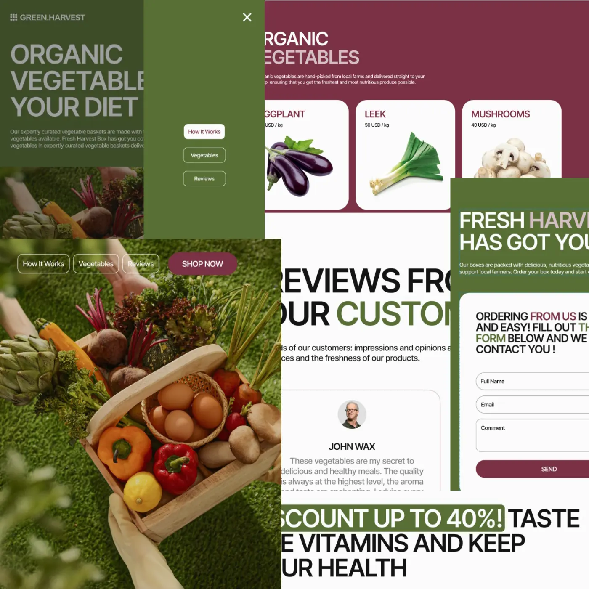

<p align="center">
  
</p>

# 🌿 GreenHarvest — Organic Vegetables to Your Diet

A responsive landing page for an organic vegetable delivery service. Built as a
pet project to practice modern frontend development with Vite.

🔗 **Live Demo:**
[bashmachok1982.github.io/GreenHarvest-project-Vite-Alexander](https://bashmachok1982.github.io/GreenHarvest-project-Vite-Alexander/)

---

## ✨ Features

- **Fully responsive** — mobile (375px), tablet (768px), desktop (1280px+)
- **Adaptive header** — transparent overlay on hero section, burger menu on
  mobile/tablet
- **GLightbox gallery** — click on a vegetable card to open a real farm photo,
  different images per breakpoint
- **Horizontal scroll slider** — reviews section with scroll-snap and animated
  dots
- **Contact form** — live validation, iziToast notifications, button activates
  only when all fields are valid
- **Smooth scroll** — navigation links and Shop Now button scroll to sections
- **Lazy loading** — all images load on demand
- **WebP images** — optimized assets for fast loading

---

## 🛠 Tech Stack

| Tool                                                                 | Purpose                 |
| -------------------------------------------------------------------- | ----------------------- |
| [Vite](https://vitejs.dev/)                                          | Build tool & dev server |
| HTML / CSS / JavaScript                                              | Core technologies       |
| [Inter Tight](https://fonts.google.com/specimen/Inter+Tight)         | Typography              |
| [GLightbox](https://biati-digital.github.io/glightbox/)              | Image lightbox gallery  |
| [iziToast](https://izitoast.marcelodolza.com/)                       | Toast notifications     |
| [modern-normalize](https://github.com/sindresorhus/modern-normalize) | CSS reset               |
| GitHub Pages                                                         | Deployment              |

---

## 📁 Project Structure

```
src/
├── css/          — styles per section
├── js/           — scripts (menu, lightbox, form, reviews)
├── img/          — illustrations and UI images
├── public/img/   — lightbox photos (served as static assets)
├── partials/     — HTML partials (header, footer, sections)
└── index.html
```

---

## 🚀 Getting Started

```bash
# Install dependencies
npm install

# Start dev server
npm run dev

# Build for production
npm run build
```

---

## 📸 Sections

- **Hero** — full-screen with overlay image, transparent header
- **How It Works** — 3-step order guide with illustrated photo
- **Vegetables** — 6 product cards with GLightbox farm photos
- **Reviews** — horizontal scroll slider with 3 customer reviews
- **Contact** — order form with validation + social links
- **Footer** — navigation, contacts, legal links

---

_Made with 🌱 by [Bashmachok1982](https://github.com/Bashmachok1982)_
